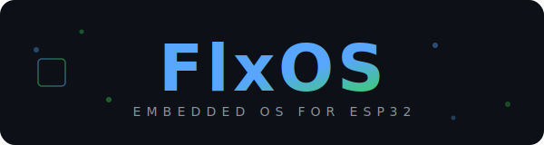

<p align="center">
  
</p>

<p align="center">
  A modular, profile-driven operating system for ESP32 devices
  <br />
  Built on <strong>ESP-IDF</strong> · <strong>LVGL</strong> · <strong>LovyanGFX</strong>
</p>

<p align="center">
  <a href="https://github.com/flxos-labs/flxos/actions/workflows/build.yml"></a>
  <a href="https://github.com/flxos-labs/flxos/actions/workflows/code-quality.yml"></a>
  <a href="https://github.com/flxos-labs/flxos/releases"></a>
  <a href="LICENSE"></a>
</p>

---

## Overview

**FlxOS** is a feature-rich operating system designed for ESP32-family microcontrollers. It provides a complete application framework with a graphical user interface, modular hardware abstraction, and a powerful profile-based build system that allows a single codebase to target a wide variety of boards and display configurations.

### Key Features

- 🖥️ **Rich GUI** — LVGL-powered touch UI with theming and animations
- 🔌 **Multi-Board Support** — Profile system for hardware-specific builds (ESP32, ESP32-S2, ESP32-S3, ESP32-C3, ESP32-C6, ESP32-H2, ESP32-P4)
- 📱 **Built-in Apps** — Calendar, File Manager, Image Viewer, Text Editor, Settings, System Info, and more
- 🛜 **Connectivity** — WiFi, networking, and related services
- 🧩 **Modular Architecture** — Clean separation of Core, Kernel, UI, and Hardware layers
- ⚡ **One-Command Builds** — `flxos.py` CLI handles profile selection, target switching, building, flashing, and releasing
- 🎨 **Display-Agnostic** — LovyanGFX backend supports ILI9341, ST7789, and many more display controllers
- 🔧 **Headless Mode** — Run without a display for embedded/server use cases

---

## Project Structure

```
flxos/
├── Applications/        # User-facing apps (calendar, files, settings, tools, ...)
├── Apps/                # App framework and lifecycle management
├── Buildscripts/        # CMake modules, profile loader, HW code generator
├── Connectivity/        # WiFi, networking modules
├── Core/                # Core OS headers and utilities
├── Firmware/            # Firmware entry point and initialization
├── HalModule/           # Hardware Abstraction Layer
├── Kernel/              # Kernel services (tasks, memory, logging)
├── Profiles/            # Board/device profiles (YAML + generated config)
├── Services/            # System services
├── System/              # System-level modules (drivers, buses, peripherals)
├── UI/                  # LVGL UI framework, themes, and widgets
├── assets/              # Static assets (fonts, images)
├── components/          # Third-party libs (LVGL, LovyanGFX — git submodules)
├── scripts/             # Dev tools (code quality, formatting, analysis)
├── releases/            # Release artifact output
├── flxos.py             # Main CLI build tool
├── CMakeLists.txt       # Top-level CMake project file
└── sdkconfig.defaults   # Global ESP-IDF defaults
```

---

## Prerequisites

| Requirement | Version |
|---|---|
| [ESP-IDF](https://docs.espressif.com/projects/esp-idf/en/stable/esp32/get-started/) | v5.5+ |
| Python | 3.10+ |
| CMake | 3.16+ |

Make sure to source the ESP-IDF environment before running any commands:

```bash
# Adjust the path to match your ESP-IDF installation
source $IDF_PATH/export.sh
# e.g. source ~/esp/esp-idf/export.sh
```

---

## Quick Start

### 1. Clone the Repository

```bash
git clone --recurse-submodules https://github.com/flxos-labs/flxos.git
cd flxos
```

### 2. List Available Profiles

```bash
python flxos.py list
```

### 3. Select a Profile

```bash
python flxos.py select <profile-id>
# e.g. python flxos.py select esp32s3-ili9341-xpt
```

### 4. Build

```bash
python flxos.py build
```

### 5. Flash

```bash
python flxos.py flash --port /dev/ttyUSB0
```

---

## CLI Reference

The `flxos.py` script is the single entry point for all build operations:

| Command | Description |
|---|---|
| `list [--json]` | List all available profiles |
| `select <id>` | Select a profile for building |
| `build [--all] [--dev]` | Build current or all profiles |
| `validate [id]` | Validate profile YAML(s) against schema |
| `info <id>` | Show detailed profile information |
| `new <id>` | Scaffold a new profile |
| `diff <a> <b> [--json]` | Compare two profiles |
| `hwgen [id] [--all]` | Generate HWD init code from profile |
| `flash [--port]` | Flash the current build to device |
| `release <version>` | Package release artifacts |
| `cdn <version>` | Generate ESP Web Tools manifests |
| `doctor` | Check build environment health |

---

## Profiles

Profiles live in `Profiles/<profile-id>/profile.yaml` and define everything about a target board:

- **SoC target** — `esp32`, `esp32s3`, etc.
- **Flash configuration** — size, mode, frequency
- **Display** — driver, resolution, color depth, pin mapping
- **Touch** — driver and pin mapping
- **Peripherals** — SD card, battery ADC, SPIRAM
- **SDK config overrides** — per-profile `sdkconfig` passthrough

Profiles can **inherit** from base profiles in `Profiles/_bases/` to avoid duplication.

```bash
# Validate all profiles
python flxos.py validate

# View profile details
python flxos.py info esp32s3-ili9341-xpt
```

---

## Development

### Dev Mode Build

Use `--dev` for faster iteration with a 4 MB partition table:

```bash
python flxos.py build --dev
```

### Code Quality

```bash
# Format code
bash scripts/code_format.sh

# Run code quality checks
bash scripts/code_quality.sh

# Check naming conventions
python scripts/check_naming.py
```

### Adding a New App

1. Create a directory under `Applications/<app-name>/`
2. Add `Include/` and `Source/` subdirectories
3. Register the component in `Applications/CMakeLists.txt`

---

## Third-Party Components

| Component | License | Purpose |
|---|---|---|
| [LVGL](https://github.com/lvgl/lvgl) | MIT | Graphics library and UI framework |
| [LovyanGFX](https://github.com/lovyan03/LovyanGFX) | BSD-2-Clause | Display & touch driver abstraction |

See [NOTICE](NOTICE) for full third-party license texts.

---

## CI/CD

GitHub Actions workflows are included for:

- **Build** — Multi-profile matrix build (`build.yml`)
- **Code Quality** — Formatting, linting, naming, and documentation checks (`code-quality.yml`)

---

## License

FlxOS is licensed under the **GNU Affero General Public License v3.0 (AGPL-3.0)**.

See [LICENSE](LICENSE) for the full text.
